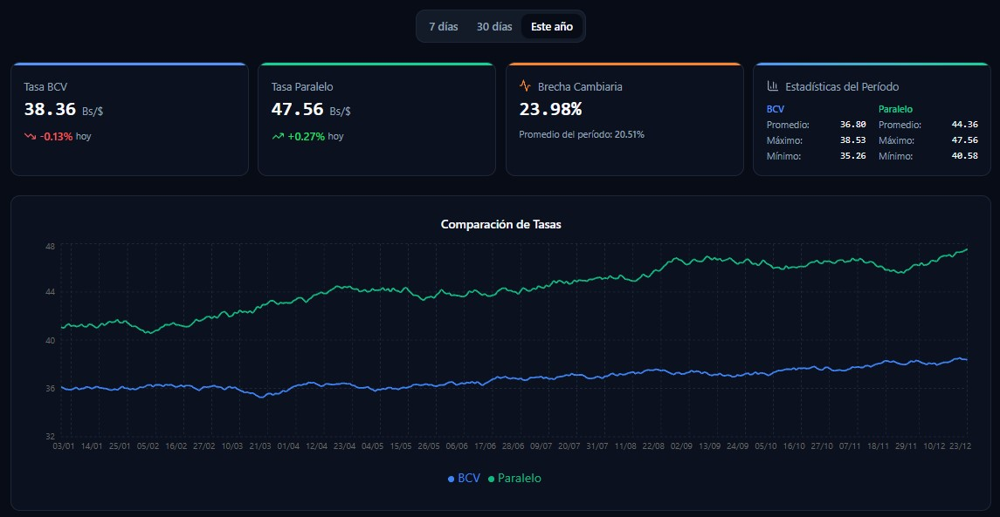

# VES Tracker 🚀

## Descripción
**VES Tracker** es un dashboard personal de monitoreo cambiario y análisis de brecha entre la tasa oficial del BCV y el mercado USDT/Paralelo en Venezuela. La aplicación proporciona una visualización clara y técnica de los datos financieros para facilitar el seguimiento del poder adquisitivo y la toma de decisiones económicas diarias.

## Captura de pantalla

La siguiente imagen muestra la vista principal (Home) de la aplicación.



## Características Principales
* **Análisis de Brecha**: Cálculo automático y visualización del diferencial porcentual entre tasas.
* **Visualización Dinámica**: Gráficas interactivas desarrolladas con Recharts sincronizadas para análisis comparativo.
* **Diseño Mobile First**: Interfaz optimizada para una experiencia fluida en dispositivos móviles.
* **Modo Oscuro Nativo**: Soporte completo de temas claro y oscuro mediante Tailwind CSS.
* **Persistencia de Datos**: Histórico detallado consumido desde base de datos propia.

## Arquitectura y Stack Técnico
El proyecto se ha desarrollado bajo la filosofía de **Clean Code** y **Clean Architecture**:

* **Framework**: Next.js (App Router).
* **Lenguaje**: TypeScript para un tipado robusto y seguro.
* **Estilos**: Tailwind CSS con `tailwind-merge` para gestión de clases dinámicas.
* **Componentes**: Estructura basada en **Feature Components** (ubicados en `src/features/`), donde cada funcionalidad es autosuficiente y contiene sus propios Hooks, Services, Components, Containers y Context.

## Cómo ejecutar (rápido)

1. Instalar dependencias:

```bash
npm install
```

2. Ejecutar en modo desarrollo:

```bash
npm run dev
```

3. Abrir http://localhost:3000